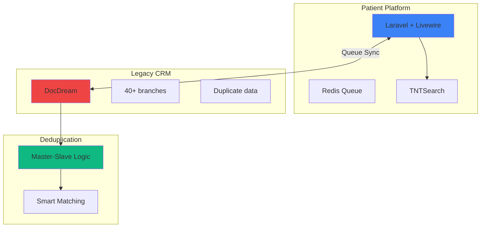

# Инструкция по созданию диаграмм для проекта Invitro

## 🎨 Где создавать диаграммы

### Рекомендуется: **Excalidraw** (https://excalidraw.com)

**Почему:**
- Бесплатно, онлайн, без регистрации
- Hand-drawn стиль - современно и дружелюбно
- Быстро рисовать блок-схемы
- Экспорт в PNG/SVG

**Настройки экспорта:**
- Format: PNG
- Scale: 2x (для качества)
- Background: включить (белый фон)
- Padding: Large

---

## 📐 Диаграмма 1: System Architecture

**Имя файла:** `diagram-architecture.png` (EN) и `diagram-architecture-ru.png` (RU)

**Путь:** `/public/images/projects/invitro/`

### Структура (English):

```
┌─────────────────────────────────────┐
│  INVITRO MEDICAL PLATFORM           │
│  System Architecture                │
└─────────────────────────────────────┘

┌───────────────────┐         ┌───────────────────┐
│  Patient Platform │         │  Legacy CRM       │
│  (New System)     │◄───────►│  (DocDream)       │
│                   │  Queue  │                   │
│  • Laravel        │  Sync   │  • 40+ branches   │
│  • Livewire       │         │  • Duplicate data │
│  • Redis Queue    │         │  • Limited API    │
│  • TNTSearch      │         │                   │
└───────────────────┘         └───────────────────┘
         │                             │
         │                             ▼
         │                    ┌───────────────────┐
         │                    │  Deduplication    │
         │                    │  Engine           │
         │                    │                   │
         │                    │  • Master-Slave   │
         │                    │  • Smart Matching │
         │                    └───────────────────┘
         ▼
┌───────────────────┐
│  Search Index     │
│  (TNTSearch)      │
│                   │
│  • 2000+ tests    │
│  • 4-5 levels     │
└───────────────────┘

Integrated new patient platform with legacy CRM
serving 40+ branches
```

### Цвета:
- Patient Platform: Синий (#3B82F6)
- Legacy CRM: Красный/Оранжевый (#EF4444) - проблема
- Deduplication: Зелёный (#10B981) - решение
- Search Index: Фиолетовый (#8B5CF6)

---

## 📐 Диаграмма 2: Deduplication Flow

**Имя файла:** `diagram-deduplication.png` (EN) и `diagram-deduplication-ru.png` (RU)

**Путь:** `/public/images/projects/invitro/`

### Структура (English):

```
┌─────────────────────────────────────┐
│  SMART DEDUPLICATION PROCESS        │
└─────────────────────────────────────┘

STEP 1: Detect Duplicates
┌────────────────────────┐
│  Duplicate Records     │
│  Found in Legacy CRM   │
│                        │
│  Ivan P.  +373 69...   │
│  Ivan P.  +373 69...   │
│  I. Petrov +373 69...  │
└────────────────────────┘
           ↓

STEP 2: Analyze & Score
┌────────────────────────┐
│  Intelligence Layer    │
│                        │
│  ✓ Last updated time   │
│  ✓ Data richness       │
│  ✓ Relationships count │
│  ✓ Phone + name match  │
└────────────────────────┘
           ↓

STEP 3: Master Assignment
┌────────────────────────┐
│  Record #12345         │
│  → MASTER              │
│  (most recent, rich)   │
│                        │
│  Record #67890 → Slave │
│    master_id: 12345    │
│                        │
│  Record #11223 → Slave │
│    master_id: 12345    │
└────────────────────────┘
           ↓

STEP 4: Queue Processing
┌────────────────────────┐
│  Async Sync via Redis  │
│                        │
│  • Background jobs     │
│  • Conflict detection  │
│  • Admin review panel  │
└────────────────────────┘
           ↓

✓ RESULT
┌────────────────────────┐
│  Clean Unified Data    │
│                        │
│  ✓ No duplicates       │
│  ✓ History preserved   │
│  ✓ Real-time sync      │
└────────────────────────┘

Resolved thousands of duplicate patient records
while maintaining data integrity
```

### Цвета:
- STEP 1: Красный (#EF4444) - проблема
- STEP 2: Оранжевый (#F97316) - анализ
- STEP 3: Жёлтый (#EAB308) - обработка
- STEP 4: Голубой (#06B6D4) - автоматизация
- RESULT: Зелёный (#10B981) - решение

---

## 📐 Диаграмма 3: User Journey (Before/After)

**Имя файла:** `diagram-user-journey.png` (EN) и `diagram-user-journey-ru.png` (RU)

**Путь:** `/public/images/projects/invitro/`

### Структура (English):

```
┌─────────────────────────────────────────────────────────┐
│  PATIENT EXPERIENCE: TRANSFORMATION                      │
└─────────────────────────────────────────────────────────┘

❌ BEFORE (Old System)           ✅ AFTER (New Platform)
─────────────────────────        ─────────────────────────

Patient needs test               Patient visits website
       ↓                                  ↓
Call Center                      Register online
(busy, 5-15 min wait)           (2 minutes)
       ↓                                  ↓
Wait for operator                Browse 2000+ tests
       ↓                         with TNTSearch
Operator books manually                  ↓
       ↓                         Add family members
Call again for                   to account
family member                            ↓
       ↓                         Book appointments
No online access                 (self + family)
       ↓                                  ↓
No appointment tracking          Choose payment:
                                 Cash OR Online
                                         ↓
                                 Get confirmation
                                         ↓
                                 Track in cabinet
                                         ↓
                                 View test results


Problems:                        Benefits:
• High call center load          ✓ 24/7 self-service
• Long wait times                ✓ Family management
• No online booking              ✓ Fast search
• Manual errors                  ✓ Online payment
• No self-tracking               ✓ Real-time tracking


Transformed from phone-dependent bookings
to 24/7 self-service platform
```

### Цвета:
- BEFORE column: Серый (#6B7280) с красными акцентами
- AFTER column: Синий (#3B82F6) с зелёными акцентами
- Problems: Красный (#EF4444)
- Benefits: Зелёный (#10B981)

---

## 🛠️ Альтернативный способ: Mermaid

Если хотите использовать код для генерации диаграмм, используйте **Mermaid** (https://mermaid.live)

### Пример Mermaid кода для Architecture:



Вставьте этот код в https://mermaid.live и экспортируйте как PNG.

---

## 📝 Чеклист после создания диаграмм:

- [ ] Созданы 3 диаграммы на английском
- [ ] Созданы 3 диаграммы на русском (опционально, можно использовать те же с английским текстом)
- [ ] Файлы названы правильно:
  - `diagram-architecture.png`
  - `diagram-deduplication.png`
  - `diagram-user-journey.png`
- [ ] Файлы размещены в `/public/images/projects/invitro/`
- [ ] Размер файлов оптимизирован (желательно < 200KB каждый)
- [ ] Диаграммы читаемы на мобильных устройствах

---

## 🎨 Советы по дизайну:

1. **Шрифт**: Используйте крупный, читаемый шрифт (минимум 14px в Excalidraw)
2. **Контраст**: Убедитесь, что текст хорошо виден на фоне блоков
3. **Стрелки**: Используйте чёткие стрелки с подписями
4. **Выравнивание**: Выровняйте блоки для профессионального вида
5. **Пробелы**: Оставляйте достаточно пространства между элементами
6. **Цветовая схема**: Придерживайтесь предложенных цветов для консистентности

---

## 🚀 После создания диаграмм:

1. Поместите PNG файлы в `/public/images/projects/invitro/`
2. Убедитесь, что пути в `projects.ts` соответствуют реальным файлам
3. Запустите `npm run dev` и перейдите на `/projects/invitro-medical-platform`
4. Проверьте, что диаграммы отображаются корректно
5. Протестируйте переключение между табами

---

## 💡 Быстрый старт с AI:

Если хотите использовать AI для генерации, попробуйте:

**ChatGPT Prompt:**
```
Create a system architecture diagram for a medical platform project with these components:
1. Patient Platform (Laravel + Livewire, Redis Queue, TNTSearch)
2. Legacy CRM (DocDream, 40+ branches, duplicate data)
3. Deduplication Engine (Master-Slave logic, Smart matching)

Show the connections between components with arrows labeled "Queue Sync".
Use blue color for new platform, red for legacy system, green for deduplication.
Export as a clean, professional diagram suitable for a portfolio.
```

**Или используйте Claude/Gemini** для генерации Mermaid кода, затем конвертируйте в PNG.
