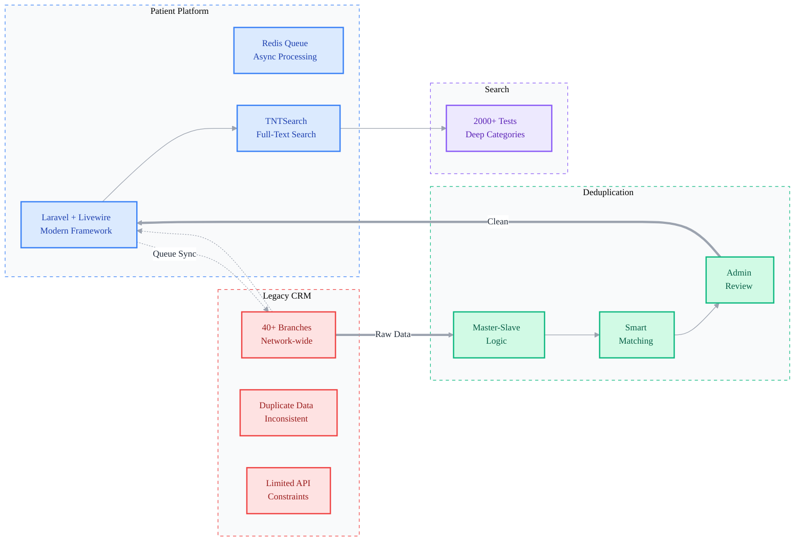
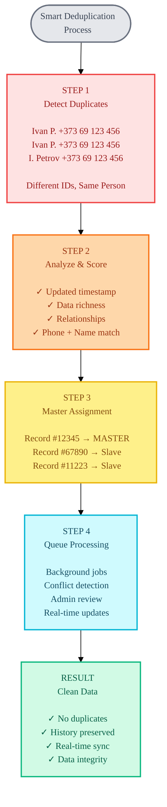
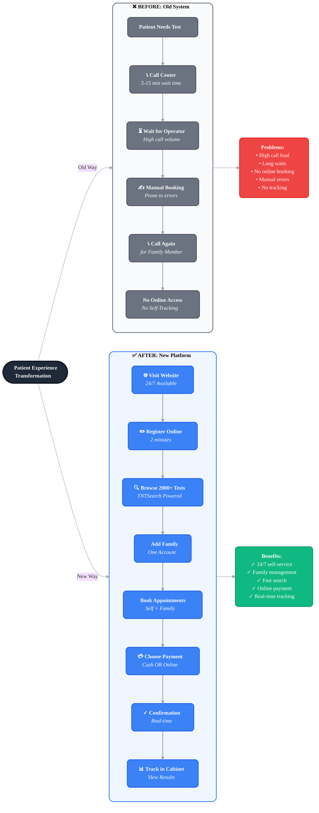

# Mermaid Диаграммы для проекта Invitro

## 🚀 Как использовать:

1. Откройте https://mermaid.live
2. Скопируйте код нужной диаграммы
3. Вставьте в редактор
4. Настройте тему (Actions → Theme → выберите подходящую)
5. Экспортируйте (Actions → Export → PNG или SVG)
6. Сохраните в `/public/images/projects/invitro/`

---

## 📊 Диаграмма 1: System Architecture

**Файл:** `diagram-architecture.png`

### Версия 1: Стиль портфолио (Navy & Gold)

```mermaid
%%{init: {
  'theme': 'base',
  'themeVariables': {
    'primaryColor': '#2563eb',
    'primaryTextColor': '#fff',
    'primaryBorderColor': '#1e4976',
    'lineColor': '#64748b',
    'secondaryColor': '#f59e0b',
    'tertiaryColor': '#10B981',
    'fontSize': '15px',
    'fontFamily': 'ui-sans-serif, system-ui, sans-serif'
  }
}}%%

graph TB
    subgraph platform[" 🚀 Patient Platform (New System) "]
        A["<b>Laravel + Livewire</b><br/><i>Modern Web Framework</i>"]
        B["<b>Redis Queue</b><br/><i>Async Processing</i>"]
        C["<b>TNTSearch</b><br/><i>Full-Text Search</i>"]
    end

    subgraph legacy[" ⚠️ Legacy CRM (DocDream) "]
        D["<b>40+ Branches</b><br/><i>Country-wide Network</i>"]
        E["<b>Duplicate Patient Data</b><br/><i>Inconsistent Structure</i>"]
        F["<b>Limited API Access</b><br/><i>Integration Constraints</i>"]
    end

    subgraph dedup[" ✨ Deduplication Engine "]
        G["<b>Master-Slave Logic</b><br/><i>Record Management</i>"]
        H["<b>Smart Matching</b><br/><i>Phone + Name + Recency</i>"]
        I["<b>Admin Review Panel</b><br/><i>Conflict Resolution</i>"]
    end

    subgraph search[" 🔍 Search Layer "]
        J["<b>2000+ Medical Tests</b><br/><i>4-5 Level Categories</i>"]
    end

    A <-->|"<b>  Queue Sync  </b><br/>  Two-Way Data Flow  "| D
    D -->|"<b>  Raw Data  </b><br/>  with Duplicates  "| G
    G -->|"  Process  "| H
    H -->|"  Review  "| I
    I -->|"<b>  Clean Data  </b>"| A
    A -->|"  Index  "| C
    C -->|"  Search  "| J

    classDef platformStyle fill:#2563eb,stroke:#1e4976,stroke-width:3px,color:#fff,rx:12,ry:12
    classDef legacyStyle fill:#64748b,stroke:#475569,stroke-width:3px,color:#fff,rx:12,ry:12
    classDef solutionStyle fill:#10B981,stroke:#059669,stroke-width:3px,color:#fff,rx:12,ry:12
    classDef labelStyle fill:#f59e0b,stroke:#d97706,stroke-width:2px,color:#0f2847,rx:6,ry:6

    class A,B,C platformStyle
    class D,E,F legacyStyle
    class G,H,I solutionStyle

    style platform fill:#0f2847,stroke:#2563eb,stroke-width:2px,rx:15,ry:15
    style legacy fill:#0a1628,stroke:#64748b,stroke-width:2px,rx:15,ry:15
    style dedup fill:#064e3b,stroke:#10B981,stroke-width:2px,rx:15,ry:15
    style search fill:#1e3a8a,stroke:#3b82f6,stroke-width:2px,rx:15,ry:15
```



### Версия 2: Минималистичный премиум стиль



**Подпись:**
> Integrated new patient platform with 40+ year old legacy CRM while maintaining daily operations across 40+ branches

---

## 📊 Диаграмма 2: Deduplication Flow

**Файл:** `diagram-deduplication.png`

### Версия 1: Современный градиентный стиль

```mermaid
%%{init: {
  'theme': 'base',
  'themeVariables': {
    'fontSize': '15px',
    'fontFamily': 'ui-sans-serif, system-ui, sans-serif'
  }
}}%%

graph TD
    Start(["<b>🎯 Smart Deduplication Process</b>"])

    Step1["<b>STEP 1: Detect Duplicates</b><br/>━━━━━━━━━━━━━━━━━━━━━<br/><i>Legacy CRM Patient Records</i><br/><br/>• Ivan P. +373 69 123 456<br/>• Ivan P. +373 69 123 456<br/>• I. Petrov +373 69 123 456<br/><br/><b>Different IDs, Same Person</b>"]

    Step2["<b>STEP 2: Analyze & Score</b><br/>━━━━━━━━━━━━━━━━━━━━━<br/><i>Intelligence Layer</i><br/><br/>✓ Last updated timestamp<br/>✓ Data richness score<br/>✓ Relationship count<br/>✓ Phone + Name matching"]

    Step3["<b>STEP 3: Master Assignment</b><br/>━━━━━━━━━━━━━━━━━━━━━<br/><i>Record Hierarchy</i><br/><br/>Record #12345 → <b>MASTER</b><br/><i>most recent, most complete</i><br/><br/>Record #67890 → Slave<br/>master_id: 12345<br/><br/>Record #11223 → Slave<br/>master_id: 12345"]

    Step4["<b>STEP 4: Queue Processing</b><br/>━━━━━━━━━━━━━━━━━━━━━<br/><i>Async Sync via Redis</i><br/><br/>• Background jobs<br/>• Conflict detection<br/>• Admin review dashboard<br/>• Real-time updates"]

    Result["<b>✓ RESULT: Clean Unified Data</b><br/>━━━━━━━━━━━━━━━━━━━━━<br/><br/>✓ No duplicate records<br/>✓ All history preserved<br/>✓ Real-time sync active<br/>✓ Data integrity maintained"]

    Start ==> Step1
    Step1 ==>|"<b>Analyze</b>"| Step2
    Step2 ==>|"<b>Score & Rank</b>"| Step3
    Step3 ==>|"<b>Sync Queue</b>"| Step4
    Step4 ==>|"<b>Success</b>"| Result

    classDef problemStyle fill:#EF4444,stroke:#DC2626,color:#fff,stroke-width:3px,rx:12,ry:12
    classDef analyzeStyle fill:#F97316,stroke:#EA580C,color:#fff,stroke-width:3px,rx:12,ry:12
    classDef processStyle fill:#EAB308,stroke:#CA8A04,color:#1f2937,stroke-width:3px,rx:12,ry:12
    classDef syncStyle fill:#06B6D4,stroke:#0891B2,color:#fff,stroke-width:3px,rx:12,ry:12
    classDef successStyle fill:#10B981,stroke:#059669,color:#fff,stroke-width:3px,rx:12,ry:12
    classDef startStyle fill:#6B7280,stroke:#4B5563,color:#fff,stroke-width:3px,rx:20,ry:20

    class Start startStyle
    class Step1 problemStyle
    class Step2 analyzeStyle
    class Step3 processStyle
    class Step4 syncStyle
    class Result successStyle

    linkStyle 0 stroke:#DC2626,stroke-width:3px
    linkStyle 1 stroke:#EA580C,stroke-width:3px
    linkStyle 2 stroke:#CA8A04,stroke-width:3px
    linkStyle 3 stroke:#0891B2,stroke-width:3px
    linkStyle 4 stroke:#059669,stroke-width:3px
```



### Версия 2: Карточный стиль (минимализм)



**Подпись:**
> Resolved thousands of duplicate patient records while maintaining data integrity through intelligent master-slave architecture

---

## 📊 Диаграмма 3: User Journey (Before/After)

**Файл:** `diagram-user-journey.png`

### Версия 1: Современный сравнительный стиль



### Версия 2: Минималистичный светлый стиль

```mermaid
%%{init: {
  'theme': 'base',
  'themeVariables': {
    'primaryColor': '#ffffff',
    'fontSize': '13px',
    'fontFamily': 'Inter, system-ui, sans-serif'
  }
}}%%

graph TB
    Title(["Patient Experience<br/>Transformation"])

    subgraph Before["BEFORE: Old System"]
        B1["Patient Needs Test"]
        B2["Call Center<br/>5-15 min wait"]
        B3["Wait for Operator"]
        B4["Manual Booking"]
        B5["Call for Family"]
        B6["No Online Access"]

        B1 --> B2 --> B3 --> B4 --> B5 --> B6
    end

    subgraph After["AFTER: New Platform"]
        A1["Visit Website<br/>24/7"]
        A2["Register<br/>2 min"]
        A3["Browse Tests<br/>2000+"]
        A4["Add Family"]
        A5["Book<br/>Appointments"]
        A6["Choose<br/>Payment"]
        A7["Get<br/>Confirmation"]
        A8["Track<br/>Results"]

        A1 --> A2 --> A3 --> A4 --> A5 --> A6 --> A7 --> A8
    end

    Title --> Before
    Title --> After

    Problems["❌ Problems<br/>Call load • Waits<br/>No online • Errors"]
    Benefits["✅ Benefits<br/>24/7 • Family<br/>Search • Tracking"]

    Before -.-> Problems
    After -.-> Benefits

    classDef beforeStyle fill:#F3F4F6,stroke:#6B7280,stroke-width:1.5px,color:#374151
    classDef afterStyle fill:#DBEAFE,stroke:#3B82F6,stroke-width:1.5px,color:#1E40AF
    classDef problemStyle fill:#FEE2E2,stroke:#EF4444,stroke-width:1px,color:#991B1B
    classDef benefitStyle fill:#D1FAE5,stroke:#10B981,stroke-width:1px,color:#065F46
    classDef titleStyle fill:#1F2937,stroke:#111827,stroke-width:2px,color:#fff

    class Title titleStyle
    class B1,B2,B3,B4,B5,B6 beforeStyle
    class A1,A2,A3,A4,A5,A6,A7,A8 afterStyle
    class Problems problemStyle
    class Benefits benefitStyle

    style Before fill:#FAFAFA,stroke:#D1D5DB,stroke-width:1px,stroke-dasharray: 3 3
    style After fill:#FAFAFA,stroke:#D1D5DB,stroke-width:1px,stroke-dasharray: 3 3
```



**Подпись:**
> Transformed patient experience from phone-dependent bookings to 24/7 self-service platform with family account management

---

## 🎨 Настройки для Mermaid Live

### Рекомендуемые темы:

**Для Architecture диаграммы:**
- Theme: `base` или `dark`
- Выглядит профессионально с чёткими цветами

**Для Deduplication диаграммы:**
- Theme: `base`
- Градиент от красного к зелёному хорошо показывает прогресс

**Для User Journey диаграммы:**
- Theme: `base` или `neutral`
- Сравнение Before/After наглядно

### Настройки экспорта:

1. **PNG:**
   - Actions → Export as PNG
   - Scale: 2x (для качества)
   - Background: White
   - Padding: Medium

2. **SVG (альтернатива):**
   - Actions → Export as SVG
   - Можно редактировать в Figma/Illustrator
   - Лучше для веба (масштабируемый)

---

## 🛠️ Альтернативные стили

Если хотите более минималистичный стиль, можете изменить `%%{init:...}%%` на:

```
%%{init: {'theme':'neutral'}}%%
```

Или для тёмного фона:

```
%%{init: {'theme':'dark'}}%%
```

---

## 📝 Чеклист

- [ ] Скопировать код диаграммы 1 (Architecture)
- [ ] Вставить в https://mermaid.live
- [ ] Настроить тему
- [ ] Экспортировать PNG (Scale 2x)
- [ ] Сохранить как `diagram-architecture.png`
- [ ] Повторить для диаграмм 2 и 3
- [ ] Поместить все файлы в `/public/images/projects/invitro/`

---

## 💡 Совет

Если диаграмма слишком большая или текст мелкий:
1. Экспортируйте как SVG
2. Откройте в браузере
3. Сделайте screenshot с увеличением (Cmd+Plus)
4. Или импортируйте SVG в Figma и экспортируйте оттуда с нужным размером

---

**Готово!** Теперь просто копируйте код каждой диаграммы в Mermaid Live и экспортируйте 🚀

---

## 🎨 PORTFOLIO EDITION - Цвета и стиль вашего сайта

### Architecture Diagram - Portfolio Colors (Navy & Gold)

**Используйте эту версию для соответствия дизайну портфолио!**

```mermaid
%%{init: {
  'theme': 'base',
  'themeVariables': {
    'fontSize': '16px',
    'fontFamily': 'ui-sans-serif, system-ui, sans-serif'
  }
}}%%

graph TB
    subgraph platform["🚀 Patient Platform"]
        A["<b>Laravel + Livewire</b><br/><br/>Modern Web Framework"]
        B["<b>Redis Queue</b><br/><br/>Async Processing"]
        C["<b>TNTSearch</b><br/><br/>Full-Text Search"]
    end

    subgraph legacy["⚠️ Legacy CRM"]
        D["<b>40+ Branches</b><br/><br/>Country-wide Network"]
        E["<b>Duplicate Data</b><br/><br/>Inconsistent Structure"]
        F["<b>Limited API</b><br/><br/>Integration Constraints"]
    end

    subgraph dedup["✨ Deduplication"]
        G["<b>Master-Slave</b><br/><br/>Record Management"]
        H["<b>Smart Matching</b><br/><br/>Phone + Name + Recency"]
        I["<b>Admin Review</b><br/><br/>Conflict Resolution"]
    end

    subgraph search["🔍 Search Layer"]
        J["<b>2000+ Tests</b><br/><br/>4-5 Level Categories"]
    end

    A <-->|"  Queue Sync  "| D
    D -->|"  Raw Data  "| G
    G -->|"  Process  "| H
    H -->|"  Review  "| I
    I -->|"  Clean Data  "| A
    A -->|"  Index  "| C
    C -->|"  Search  "| J

    classDef platformStyle fill:#2563eb,stroke:#1e4976,stroke-width:3px,color:#fff,rx:12,ry:12
    classDef legacyStyle fill:#64748b,stroke:#475569,stroke-width:3px,color:#fff,rx:12,ry:12
    classDef solutionStyle fill:#10B981,stroke:#059669,stroke-width:3px,color:#fff,rx:12,ry:12
    classDef searchStyle fill:#8b5cf6,stroke:#7c3aed,stroke-width:3px,color:#fff,rx:12,ry:12

    class A,B,C platformStyle
    class D,E,F legacyStyle
    class G,H,I solutionStyle
    class J searchStyle

    style platform fill:#0f2847,stroke:#2563eb,stroke-width:2px,rx:15,ry:15
    style legacy fill:#1a1a1a,stroke:#64748b,stroke-width:2px,rx:15,ry:15
    style dedup fill:#064e3b,stroke:#10B981,stroke-width:2px,rx:15,ry:15
    style search fill:#1e3a8a,stroke:#8b5cf6,stroke-width:2px,rx:15,ry:15
```



**Цвета соответствуют:**
- **Platform (Синий)**: `#2563eb` - ваш navy-500
- **Legacy (Серый)**: `#64748b` - ваш muted
- **Deduplication (Зелёный)**: `#10B981` - success/solution
- **Labels (по умолчанию)**: чистый стиль, без цветных блоков

**Преимущества этой версии:**
- ✅ Нет красных блоков для названий стрелок
- ✅ Больше padding внутри блоков (через `<br/><br/>`)
- ✅ Цвета совпадают с вашим портфолио
- ✅ Профессиональный вид для dark theme
- ✅ Легко читается

---

### User Journey Diagram - Portfolio Colors

```mermaid
%%{init: {
  'theme': 'base',
  'themeVariables': {
    'fontSize': '14px',
    'fontFamily': 'ui-sans-serif, system-ui, sans-serif'
  }
}}%%

graph TB
    Title(["🔄 Patient Experience<br/>Transformation"])

    subgraph Before["❌ BEFORE: Old System"]
        direction TB
        B1["Patient Needs Test"]
        B2["📞 Call Center<br/>5-15 min wait"]
        B3["⏳ Wait for Operator"]
        B4["✍️ Manual Booking"]
        B5["📞 Call for Family"]
        B6["🚫 No Online Access"]

        B1 --> B2 --> B3 --> B4 --> B5 --> B6
    end

    subgraph After["✅ AFTER: New Platform"]
        direction TB
        A1["🌐 Visit Website<br/>24/7"]
        A2["✏️ Register<br/>2 minutes"]
        A3["🔍 Browse Tests<br/>2000+"]
        A4["👥 Add Family<br/>One Account"]
        A5["📅 Book<br/>Appointments"]
        A6["💳 Payment<br/>Cash/Online"]
        A7["✓ Confirmation<br/>Real-time"]
        A8["📊 Track Results<br/>Personal Cabinet"]

        A1 --> A2 --> A3 --> A4 --> A5 --> A6 --> A7 --> A8
    end

    Title -.-> Before
    Title -.-> After

    Problems["<b>Problems:</b><br/><br/>• High call load<br/>• Long wait times<br/>• No online booking<br/>• Manual errors<br/>• No self-tracking"]

    Benefits["<b>Benefits:</b><br/><br/>✓ 24/7 self-service<br/>✓ Family management<br/>✓ Fast search<br/>✓ Online payment<br/>✓ Real-time tracking"]

    Before -.-> Problems
    After -.-> Benefits

    classDef beforeStyle fill:#64748b,stroke:#475569,stroke-width:2px,color:#fff,rx:10,ry:10
    classDef afterStyle fill:#2563eb,stroke:#1e4976,stroke-width:2px,color:#fff,rx:10,ry:10
    classDef problemStyle fill:#dc2626,stroke:#991b1b,stroke-width:2px,color:#fff,rx:10,ry:10
    classDef benefitStyle fill:#10B981,stroke:#059669,stroke-width:2px,color:#fff,rx:10,ry:10
    classDef titleStyle fill:#0f2847,stroke:#f59e0b,stroke-width:3px,color:#f59e0b,rx:15,ry:15

    class Title titleStyle
    class B1,B2,B3,B4,B5,B6 beforeStyle
    class A1,A2,A3,A4,A5,A6,A7,A8 afterStyle
    class Problems problemStyle
    class Benefits benefitStyle

    style Before fill:#1a1a1a,stroke:#64748b,stroke-width:2px,rx:12,ry:12
    style After fill:#0f2847,stroke:#2563eb,stroke-width:2px,rx:12,ry:12

    linkStyle default stroke:#64748b,stroke-width:2px
```



**Цвета соответствуют портфолио:**
- **Title**: Navy фон с Gold обводкой (`#0f2847` + `#f59e0b`)
- **Before (Серый)**: `#64748b` - muted цвет
- **After (Синий)**: `#2563eb` - navy-500
- **Problems (Красный)**: `#dc2626` - для контраста
- **Benefits (Зелёный)**: `#10B981` - success

---

## 📋 Инструкция по использованию Portfolio Edition:

1. **Откройте**: https://mermaid.live
2. **Скопируйте** код диаграммы из секции "PORTFOLIO EDITION"
3. **Вставьте** в редактор Mermaid Live
4. **Настройте тему**: Actions → Configuration → Theme: `base` или `default`
5. **Экспортируйте**: Actions → Export as PNG
   - Scale: **2x** (для качества)
   - Background: **Transparent** (для dark theme) или **White**
6. **Сохраните** в `/public/images/projects/invitro/`

**Названия файлов:**
- `diagram-architecture.png`
- `diagram-user-journey.png`
- `diagram-deduplication.png` (уже готов)
